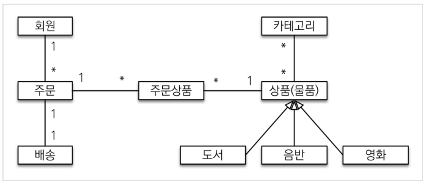
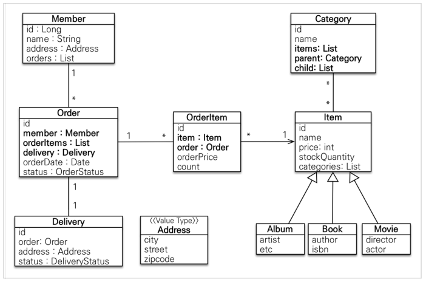
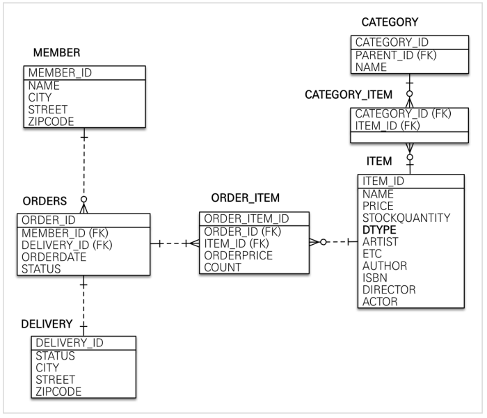

# 도메인 분석 설계

---

## 요구사항 분석

### 기능 목록

+ 회원 기능
  + 회원 등록
  + 회원 조회
+ 상품 기능
  + 상품 등록
  + 상품 수정
  + 상품 조회
+ 주문 기능
  + 상품 주문
  + 주문 내역 조회
  + 주문 취소
+ 기타 요구사항
  + 상품은 재고 관리가 필요하다.
  + 상품의 종류는 도서, 음반, 영화가 있다.
  + 상품을 카테고리로 구분할 수 있다.
  + 상품 주문시 배송 정보를 입력할 수 있다.

---

## 도메인 모델과 테이블 설계



회원과 주문: 회원은 여러 상품을 주문할 수 있다.

주문과 상품: 다대다 관계를 일대다 다대일 관계로 풀어서 사용

상품 분류: 상품은 도서, 음반, 영화로 구분되고 공통 속성을 사용하므로 상속 구조를 사용

### 엔티티



**회원**: 이름과 임베디드 타입인 Address, orders 리스트를 가짐

**주문**: 한 번 주문시 여러 상품을 주문할 수 있으므로 주문상품과(OrderItem)과는 일대다 관계

**카테고리**: 상품과 다대다 관계, `parent`,`child`로 부모, 자식 카테고리 연결

### 회원 테이블



**MEMBER**: MEMBER 테이블과 DELIVERY 테이블에 `Address`임베디드 타입 정보가 들어감

**ITEM**: 앨범, 도서, 영화 타입을 통합해서 하나의 테이블로 생성(SINGLE TABLE 전략)


### 연관관계 매핑

+ 회원과 주문: 일대다, 다대일의 양방향 관계이므로 연관계의 주인을 정해야 한다. 이 때 외래키가 있는 쪽을 주인으로 정한다. `Order.member`를 `ORDERS.MEMBER_ID` 외래 키와 매핑한다.

+ 주문상품과 주문(ORDER_ITEM, ORDER): 다대일 양방향 관게, `OrderItem.order`를 `ORDER_ITEM.ORDER_ID` 외래 키와 매핑

+ 주문과 배송: 일대일 양방향 관계. 아무곳이나 주인이 될 수 있다. 여기서는 `Order.delivery`를 `ORDEERS.DELIVEY_ID`외래 키와 매핑


---

## 엔티티 클래스

+ 예제에서는 Getter, Setter 모두 열었지만 실무에서는 Getter만 열어두고 Setter는 필요한 경우에만 사용하자.

---

```java
@Entity
@Getter @Setter
public class Member {

    @Id @GeneratedValue
    @Column(name = "member_id")
    private Long id;

    private String name;

    @Embedded
    private Address address;

    @OneToMany(mappedBy = "member")
    private List<Order> orders = new ArrayList<>();
}
```

엔티티의 식별자로 `id`를 사용하고 `PK` 컬럼명은 `member_id`를 사용한다. 객체의 필드명을 `memberId`를 사용해도 되지만 일관성있게 사용하자.

```java
@Entity
@Table(name = "orders")
@Getter @Setter
public class Order {

    @Id @GeneratedValue
    @Column(name = "order_id")
    private Long id;

    @ManyToOne(fetch = FetchType.LAZY) // 연관관계의 주인
    @JoinColumn(name = "member_id")
    private Member member;

    @OneToMany(mappedBy = "order",cascade = CascadeType.ALL)
    private List<OrderItem> orderItems = new ArrayList<>();

    @OneToOne(fetch = FetchType.LAZY, cascade = CascadeType.ALL)
    @JoinColumn(name = "delivery_id")
    private Delivery delivery;

    private LocalDateTime orderDate; //주문시간

    @Enumerated(EnumType.STRING)
    private OrderStatus status; //주문상태 [ORDER, CANCEL]

    //== 연관관계 편의 메소드==//
    public void setMember(Member member){
        this.member = member;
        member.getOrders().add(this);
    }

    public void addOrderItem(OrderItem orderItem){
        orderItems.add(orderItem);
        orderItem.setOrder(this);
    }

    public void setDelivery(Delivery delivery){
        this.delivery = delivery;
        delivery.setOrder(this);
    }

}
```

```java
@Entity
@Table(name = "order_item")
@Getter @Setter
public class OrderItem {

    @Id @GeneratedValue
    @Column(name = "order_item_id")
    private Long id;

    @ManyToOne(fetch = FetchType.LAZY)
    @JoinColumn(name = "item_id")
    private Item item;

    @ManyToOne(fetch = FetchType.LAZY)
    @JoinColumn(name = "order_id")
    private Order order;

    private int orderPrice;
    private int count;
}
```

```java
@Entity
@DiscriminatorValue("M")
@Getter @Setter
public class Movie extends Item {

    private String director;
    private String actor;
}
```

```java
@Entity
@Getter
@Setter
public class Category {

    @Id
    @GeneratedValue
    @Column(name = "category_id")
    private Long id;

    private String name;

    @ManyToMany
    @JoinTable(name = "category_item",
            joinColumns = @JoinColumn(name = "category_id"),
            inverseJoinColumns = @JoinColumn(name = "item_id")
    )
    private List<Item> items = new ArrayList<>();

    @ManyToOne(fetch = FetchType.LAZY)
    @JoinColumn(name = "parent_id")
    private Category parent;

    @OneToMany(mappedBy = "parent")
    private List<Category> child = new ArrayList<>();

    //==연관관계 편의 메소드==//
    public void addChildCategory(Category child){
        this.child.add(child);
        child.setParent(this);
    }
}
```

실무에서는 `@ManyToMany`를 사용하지 말자. 중간테이블(`CATEGORY_ITEM`)에 컬럼을 추가할 수 없기 때문에 세밀하게 쿼리를 실행하기 어렵다.  중간 엔티티를 만들어서 다대다 매핑을 다대일, 일대다 매핑으로 풀어서 사용해야한다.

```java
@Embeddable
@Getter
public class Address {

    private String city;
    private String street;
    private String zipcode;

    protected Address() {
    }

    public Address(String city, String street, String zipcode) {
        this.city = city;
        this.street = street;
        this.zipcode = zipcode;
    }
}
```

값 타입은 변경 불가능하게 사용해야 한다

`@Setter`를 쓰지 말고 생성자에서 값을 모두 초기화 하여 변경 불가능하게 설계하자. JPA는 스펙상 엔티티나 임베디드 타입은 기본 생성자를 `public`, `private`으로 설정한다.

---

## 엔티티 설계시 주의점

---

### 모든 연관관계는 지연로딩으로 설정하자.

+ 즉시로딩(`EAGER`)는 예측이 어렵고 어떤 쿼리가 실행될 지 추적하기 어렵다. JPQL을 실행할 때 `N+1` 문제가 자주 발생한다.
+ 실무에서 모든 연관관계는 `LAZY`로 설정하자.
+ 연관된 엔티티를 함께 조회해야하면 `fetch join`또는 엔티티 그래프를 사용한다.
+ `xxToOne`의 default값이 `EAGER`이므로 모두 LAZY로 설정하자.

```text
@ManyToOne(fetch = FetchType.LAZY) // 연관관계의 주인
@JoinColumn(name = "member_id")
private Member member;
```

### 컬렉션은 필드에서 초기화하자.

+ `null`문제에 대해 안전하다.
+ 하이버네이트가 엔티티를 영속화 할 때 컬렉션을 감싸서 하이버네이트가 제공하는 내장 컬렉션으로 변경한다. 만약 `getOrder()`처럼 임이의 메서드에서 컬렉션을 잘못 생성하면 하이버네이트 내부에서 문제가 발생할 수 있다.
  + 필드에서 설정하자.  private List<OrderItem> orderItems = new ArrayList<>();

### 테이블, 컬럼명 생성 전략

스프링 부트는 다음과 같이 이름이 설정된다.
1. 카멜 케이스 -> 언더스코어 (memberPoint -> member_point)
2. `.`(점) -> `_`(언더스코어)
3. 대문자 -> 소문자

